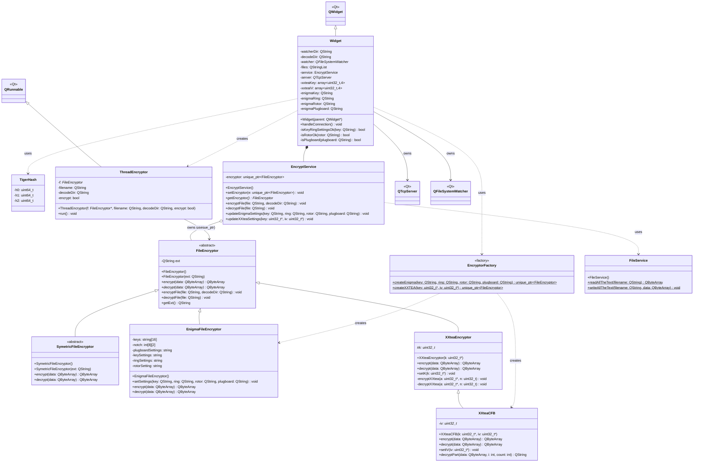

# 🔐 ZastitaInformacijaProjekat

A Qt-based C++ desktop application for encrypting and decrypting files using symmetric algorithms and custom-built encryption logic. Developed as part of an academic project focused on information protection.

---

## 📌 Features

- 🧱 Block-based file encryption and decryption
- 🔐 Multiple algorithms:
  - Custom symmetric encryption
  - Enigma-like cipher
  - XXTEA and CFB mode variants
- ⚡ Multi-threaded encryption support
- 📁 Simple and responsive Qt GUI
- 📤 Network send/receive logic
- 🐯 Optional Tiger Hash integration for hashing files

---

## 🛠️ Technologies Used

- **C++17**
- **Qt  Qt 6** (Widgets + Network)
- **CMake ≥ 3.16**

---

## 📁 Project Structure
```
.
├── CMakeCache.txt
├── cmake_install.cmake
├── CMakeLists.txt
├── .gitignore
├── main.cpp
├── Makefile
├── projekatZI_autogen
│   ├── deps
│   ├── EWIEGA46WW
│   │   ├── moc_widget.cpp
│   │   └── moc_widget.cpp.d
│   ├── include
│   │   └── ui_widget.h
│   ├── moc_predefs.h
│   ├── mocs_compilation.cpp
│   └── timestamp
├── .qt
│   ├── QtDeploySupport.cmake
│   └── QtDeployTargets.cmake
├── README.md
├── SecurityAlgo
│   ├── enigmafileencryptor.cpp
│   ├── enigmafileencryptor.h
│   ├── fileencryptor.cpp
│   ├── fileencryptor.h
│   ├── symetricfileencryptor.cpp
│   ├── symetricfileencryptor.h
│   ├── tigerhash.cpp
│   ├── tigerhash.h
│   ├── xxteacfb.cpp
│   ├── xxteacfb.h
│   ├── xxteaencryptor.cpp
│   └── xxteaencryptor.h
├── Threads
│   ├── threadencryptor.cpp
│   └── threadencryptor.h
├── widget.cpp
├── widget.h
└── widget.ui

7 directories, 33 files
```

---

## 📐 UML Class Diagram



> Note: `EnigmaFileEncryptor` inherits directly from `FileEncryptor` (not from `SymetricFileEncryptor`, which is currently unused by the rest of the codebase but kept as a reusable base for future symmetric ciphers).

---

🧰 Troubleshooting
If you encounter errors such as:

Qt6 not found

QWidget: No such file or directory

Could NOT find Qt6 (missing: Qt6Widgets)

You likely need to install the required Qt and build tools.

🐧 On Arch/Manjaro:
bash
Copy
Edit
```
sudo pacman -S qt6-base cmake g++
```
🐧 On Ubuntu/Debian:
bash
Copy
Edit
```
sudo apt update
sudo apt install qt6-base-dev cmake g++
```
💡 Tip: If you have both Qt5 and Qt6 installed, CMake will usually find Qt6 by default. You can force a specific version using -DQt6_DIR=....
```
mkdir build && cd build
cmake ..
cmake --build .
```
<h1>Screenshoots</h1>
Choose on which port will server listen on


Choose location where your file watcher will watch for new files


Choose where decrypted files will be stored after decryption


Main window


Encryption


Decryption


File watcher

